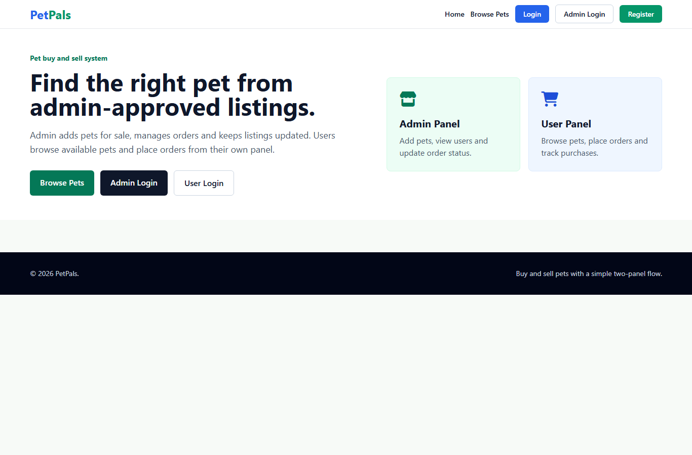
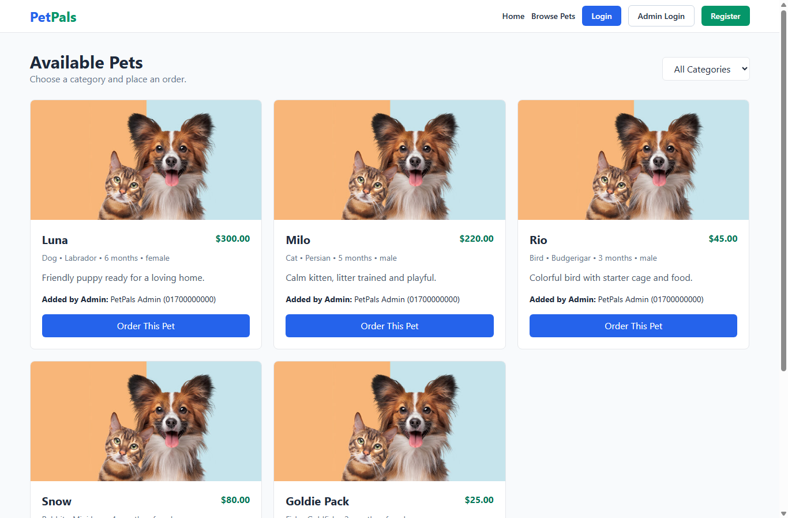
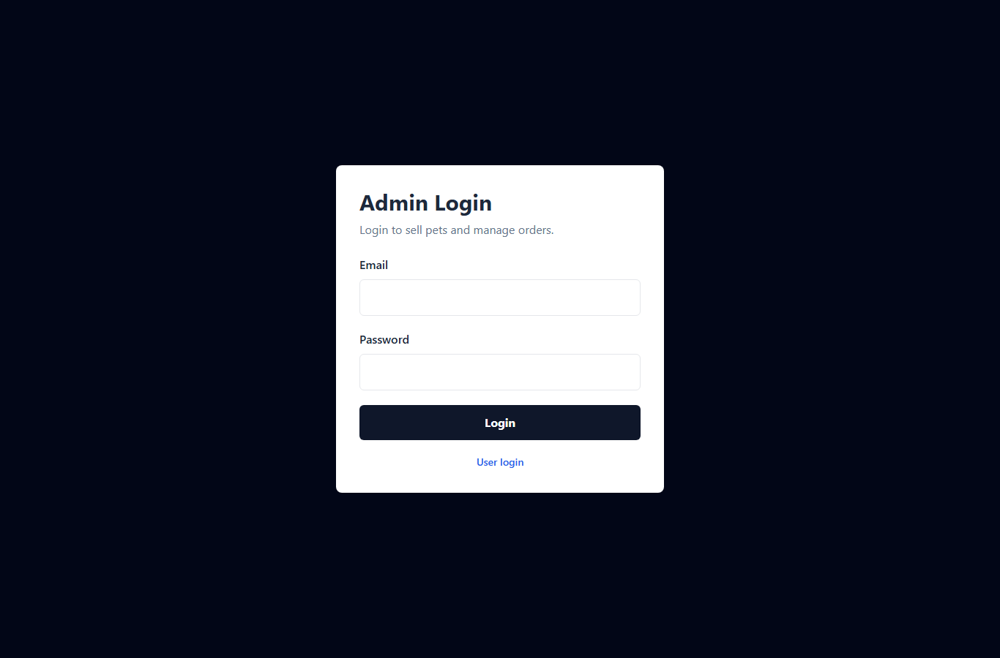
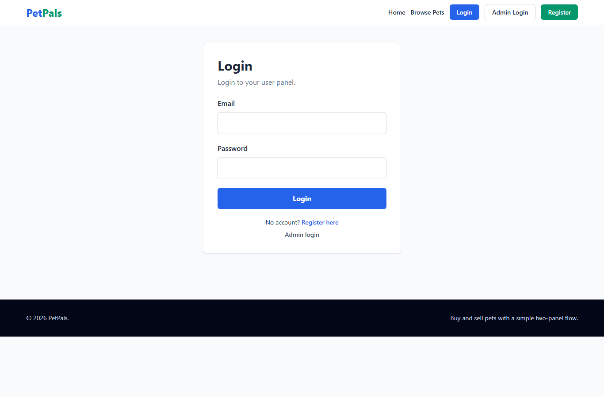

# PetPals - Buy and Sell Pets

PetPals is a simple buy/sell pet project with two fully separate panels.

- Admin Panel: admin logs in separately, adds pets for sale, manages users and orders.
- User Panel: user logs in separately, browses pets, places orders and tracks orders.

Admin and user can stay logged in at the same time in the same browser because they use separate session keys and separate database tables.

## Setup

1. Keep the project in `D:\PHP\htdocs\pat`.
2. Start Apache and MySQL from XAMPP.
3. Open `http://localhost/phpmyadmin`.
4. Import `database.sql`.
5. Open `http://localhost/pat/`.

## Login Links

| Panel | Link | Email | Password |
| --- | --- | --- | --- |
| Admin | `http://localhost/pat/admin/login.php` | `admin@petpals.com` | `123456` |
| User | `http://localhost/pat/login.php` | `user@petpals.com` | `123456` |

## Browse Links

| Use | Link | What it shows |
| --- | --- | --- |
| Home | `http://localhost/pat/` | Buy/sell pet landing page |
| Public/User Browse | `http://localhost/pat/browse.php` | Available pets and order button for logged-in users |
| Admin Browse View | `http://localhost/pat/browse.php` | Available pets view, but admin cannot order |
| Admin Add Pet | `http://localhost/pat/add-pet.php` | Admin-only pet/product add form |
| User Panel | `http://localhost/pat/user/index.php` | User orders and quick browse link |
| Admin Panel | `http://localhost/pat/admin/index.php` | Users, pets/products and order management |

## Browser Page Links

| Page | Browser Link |
| --- | --- |
| Home | `http://localhost/pat/` |
| User Login | `http://localhost/pat/login.php` |
| User Register | `http://localhost/pat/register.php` |
| User Panel | `http://localhost/pat/user/index.php` |
| Admin Login | `http://localhost/pat/admin/login.php` |
| Admin Panel | `http://localhost/pat/admin/index.php` |
| Browse Pets | `http://localhost/pat/browse.php` |
| Add Pet/Product | `http://localhost/pat/add-pet.php` |
| Admin Products | `http://localhost/pat/my-pets.php` |
| Orders | `http://localhost/pat/orders.php` |
| Profile | `http://localhost/pat/profile.php` |
| Change Password | `http://localhost/pat/pass-change.php` |

## Screenshots

### Home Page



### Browse Pets



### Admin Login



### User Login



## Bangla Summary

- Admin alada login korbe: `admin/login.php`
- User alada login korbe: `login.php`
- Admin and user same browser e same time login thakte parbe
- Admin pet add korbe and order manage korbe
- User browse kore pet order korbe
- Browse page user/admin dujoner jonno dekha jabe, but order korbe only user

## File Work List

| File/Folder | Work |
| --- | --- |
| `index.php` | Home page with buy/sell pet context and panel links |
| `login.php` | User login page |
| `register.php` | User registration page |
| `logout.php` | Logs out only the user session |
| `dashboard.php` | Redirects logged-in admin/user to the correct panel |
| `browse.php` | Shows available pets and lets logged-in users place orders |
| `add-pet.php` | Admin-only form for adding pets/products |
| `my-pets.php` | Admin-only product/pet listing page |
| `orders.php` | User order view and admin order status update page |
| `profile.php` | User profile update page |
| `pass-change.php` | User password change page |
| `database.sql` | Full database schema and demo data |
| `admin/login.php` | Separate admin login page |
| `admin/index.php` | Admin panel for users, pets/products and orders |
| `admin/logout.php` | Logs out only the admin session |
| `user/index.php` | User panel with order summary and browse link |
| `include/connection.php` | Database connection and image upload helper |
| `include/function.php` | Shared auth, session and data helper functions |
| `include/header.php` | Shared top navigation |
| `include/aside.php` | Shared side menu for root-level panel pages |
| `include/footer.php` | Shared footer |
| `uploads/` | Pet/user image upload folders and sample images |

## Database Tables

| Table | Work |
| --- | --- |
| `Admins` | Stores admin login data separately |
| `Users` | Stores user login/profile data separately |
| `Categories` | Stores pet categories |
| `Pets` | Stores pets/products added by admin |
| `Orders` | Stores user orders and order status |

## Git Setup and Push

If Git shows dubious ownership, run this once:

```powershell
git config --global --add safe.directory D:/PHP/htdocs/pat
```

First time setup:

```powershell
git init
git remote add origin https://github.com/Kamrulisl/pat.git
git branch -M main
```

Daily update/push:

```powershell
git add .
git commit -m "Update project"
git push -u origin main
```

Useful Git commands:

```powershell
git status
git log --oneline -5
git remote -v
```
